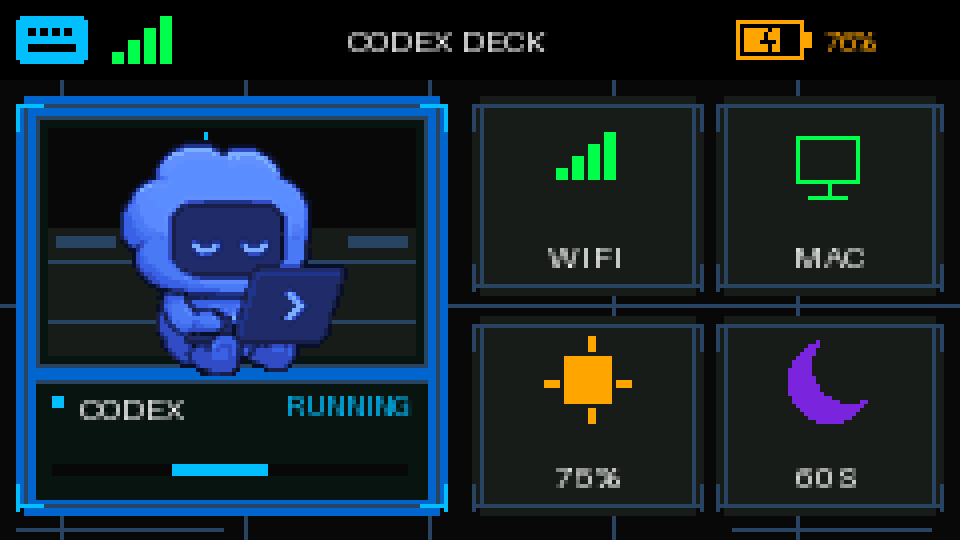
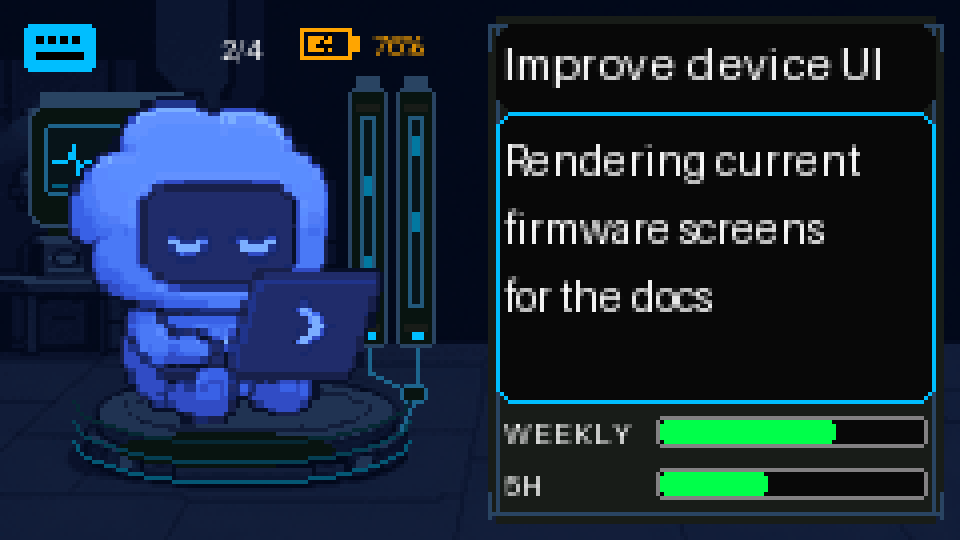

# Codex Deck

[English](README.md) | [简体中文](README.zh-CN.md)

> **Codex Deck** 是一个独立开源的 OpenAI Codex 便携硬件伴侣，把
> M5Stack Cardputer ADV 变成 macOS 上的无线键盘、麦克风和实时 Agent
> 状态屏。

Codex Deck 不是 OpenAI 官方产品，也不代表 OpenAI 官方背书。

当前 1.x macOS 安装包和桥接服务仍保留 `CardBridge` 技术兼容名，以便已有
配对、权限和音频设置平滑升级，不需要重新配置。

## 功能亮点

- **无线键盘：**发送明确的按下和抬起事件，支持 Shift、Control、Command、
  Option、方向键和可配置功能键。
- **无线麦克风：**通过经过认证的连接传输 16 kHz PCM 音频，并借助内置
  Core Audio 驱动显示为原生 macOS 输入设备。
- **Codex 实时仪表盘：**在 Cardputer 上显示最近的用户任务、Agent 阶段、
  宠物动画，以及最多八个可切换的 Codex 会话。
- **额度状态：**在可用时显示真实的 ChatGPT 每周和五小时限额；API Key
  或其他 Provider 会明确显示无限或未知状态。
- **原生 macOS 伴侣：**自带 Bridge Agent，常驻菜单栏，支持登录启动和
  已配对设备自动重连，不依赖系统 Python。
- **安全且适合自动化：**使用配对、局域网认证、钥匙串密钥、可复现构建、
  机器可读安装元数据、健康检查和端到端测试，AI 编程 Agent 可以自行执行。

## 界面截图

<table>
  <tr>
    <td align="center"><strong>主页</strong></td>
    <td align="center"><strong>Codex 详情页</strong></td>
  </tr>
  <tr>
    <td></td>
    <td></td>
  </tr>
</table>

这两张 4 倍图由当前固件布局和安全示例文案确定性生成。完整的七种视觉状态、
对应标签与常见文案、空状态、额度样式及重新生成命令见
[`docs/DEVICE_UI.zh-CN.md`](docs/DEVICE_UI.zh-CN.md)。

## 文档

安装与开发文档从 [`docs/README.md`](docs/README.md) 开始。产品要求和历史
验收记录仍保存在 `docs/` 中，但不作为规范安装入口。

仓库名是 `codex-deck`，当前硬件目标是 M5Stack Cardputer ADV。

## 安装发布版

普通用户应从 GitHub Releases 下载已签名/公证的 Codex Deck App 和匹配的
固件。校验 `SHA256SUMS`，把 `CardBridge.app` 放入 `/Applications`，启动
App 并按提示完成一次性的 macOS 权限设置。完整流程见
[`docs/INSTALL.md`](docs/INSTALL.md)。

从源码目录运行 `./scripts/install-release.sh`，脚本会自动下载、校验和挂载
DMG，然后安装 App。

当前预构建目标是 Apple Silicon + macOS 13 或更高版本。Codex Deck 需要
Cardputer ADV 连接 2.4 GHz Wi-Fi。安装 Mac App 和刷写 Cardputer 固件是
两个独立操作。

## 使用 macOS 菜单栏 App

`CardBridge.app` 是当前 1.x 的内部 bundle 名称，对外显示为 Codex Deck。
它自带签名的 Bridge Agent，启动后立即开始桥接，只显示在菜单栏，能够自动
重新连接已配对的 M5 设备，不需要 Python、虚拟环境或终端。

在 Apple Silicon 上从源码构建：

```sh
./scripts/doctor.sh
./scripts/bootstrap.sh
./scripts/test.sh
./scripts/build.sh
./scripts/install.sh
./scripts/healthcheck.sh
```

首次启动时，Codex Deck（`CardBridge.app`）会用一次 macOS 管理员授权安装
内置的 `CardBridge Microphone` HAL 驱动，然后请求 **系统设置 → 隐私与安全性
→ 辅助功能** 权限，以便转发键盘输入。麦克风会提供一个仅输入的兼容 Core
Audio 设备和一个供 Agent 使用的仅输出音频流；如果已安装 BlackHole 2ch，
它仍可作为备用方案。已有的 `~/.cardbridge` 身份和配对数据会原地迁移，
无需重新配对；配对密钥会保存到 macOS 钥匙串。

菜单栏会显示 M5、协议、本地网络、辅助功能、音频和 Codex 健康状态。设置
页面可以管理登录启动、音频增益、已配对设备、Codex Hooks、自动更新和脱敏
诊断信息。

自动化 Agent 可以运行上面的命令，但 macOS 请求管理员、辅助功能、本地网络、
钥匙串或 Codex Hook 信任时，必须暂停并等待用户明确批准。详见
[`AGENTS.md`](AGENTS.md) 和机器可读的 [`project-install.json`](project-install.json)。

## 构建固件

```sh
cd /path/to/codex-deck
pio run -d firmware/m5stack-cardputer-adv
```

如果 `pio` 不在 `PATH` 中，请先安装 PlatformIO Core。连接硬件后，Codex 可以
运行 `pio run -d firmware/m5stack-cardputer-adv -t upload` 并使用 USB 串口完成
设备验证。尽量让 PlatformIO
自动发现 `/dev/cu.usbmodem*`，因为设备重置后串口名称可能变化。

## 版本与协议

[`version.json`](version.json) 是 Mac App、Python Agent、固件、本地 Agent API、
设备协议、配置 schema 和能力列表的单一版本源。修改后运行以下命令重新生成
各语言常量：

```sh
python3 tools/generate_versions.py
```

CI 和本地验证应使用 `python3 tools/generate_versions.py --check`，以拒绝过期的
Python、C++ 或 Swift 常量。协议主版本不匹配会返回明确的 `upgrade_required`；
缺失的协议字段在迁移期间仍按旧协议 v1 兼容处理。

运行完整的本地发布门禁：

```sh
CODE_SIGN_IDENTITY="Apple Development: …" bridge/macos/scripts/release.sh
```

它会测试 Swift/Python、构建固件、打包并验证 App/Agent、签名 Sparkle 归档，
并在 `bridge/macos/dist/release-<version>/` 下写入校验和与发布清单。公开分发还需要
Developer ID Application 证书和 Apple 公证凭据，详见
[`release/README.md`](release/README.md)。

## 构建宠物动画资源

固件自带一个确定性的 Codex 主题开发吉祥物。使用随附的离线打包器重建：

```sh
python3 tools/pack_pet.py --demo \
  --output-dir firmware/m5stack-cardputer-adv/src
```

如需使用官方 `hatch-pet` 流程创建的桌面 Codex v2 宠物：

```sh
python3 tools/pack_pet.py \
  --pet-dir "$HOME/.codex/pets/my-pet" \
  --output-dir firmware/m5stack-cardputer-adv/src
```

适配器支持 1536×1872 的 8×9 App 图集和 1536×2288 的 8×11 v2 图集，只选择
Idle、Failed、Waiting、Running 和 Review 状态，将帧缩放到 72×72，共享 16 色
调色板量化，并写入 `firmware/m5stack-cardputer-adv/src/pet_assets.*` 中的行安全
RLE。Cardputer 直接从闪存
解码，在 Codex 详情页缩放到 100×100，每帧不分配图像缓冲区。

## 构建中文 UI 字体

生成的 `firmware/m5stack-cardputer-adv/assets/fonts/cardbridge-ui-13.bff` 内置了
由 Source Han Sans CN Medium
2.005R 派生的原生 13px、4-bit 抗锯齿 GB2312 字体。原生尺寸保持小屏字宽均匀，
并不是将 15px 字体做分数缩放。运行以下命令重建：

```sh
python3 tools/build_ui_font.py
```

生成器会验证固定的源字体 checksum，并通过 `npx` 调用 `lv_font_conv` 1.5.3。
Source Han Sans 使用 SIL Open Font License 1.1 发布，所需声明在
`firmware/m5stack-cardputer-adv/assets/fonts/LICENSE-SourceHanSans.txt`。

## 设备控制

- BtnA 切换键盘转发。状态栏最左侧的键盘图标表示转发是否开启；切换不会改变当前页面。
- 键盘转发开启时，`Fn+;`、`Fn+,`、`Fn+.`、`Fn+/` 发送上、左、下、右；`Fn+\`` 发送 Escape。Shift 会作为 macOS 修饰键附加到目标键，Ctrl/Cmd/Option 保持正常的按下/抬起事件。
- 键盘转发关闭时，可用印刷的方向键（`; . , /`）或 `I/J/K/L` 导航，`Enter` 确认，反引号/ESC 返回。
- 在 Codex 页面中，左右键切换当前显示的会话，`Enter` 将该会话的仅限 Cardputer 的完成/阻塞提醒标记为已读。收到新的用户提示后，宠物会自动回到该会话。
- 在 Wi-Fi 和已配对 Mac 列表中，`Backspace` 忘记或删除选中的保存项，不需要 Fn 组合键。
- 密码输入保留大小写和 Shift 符号：输入大写字母或符号时按住 `Shift`；`Backspace` 编辑，反引号/ESC 取消。
- Wi-Fi 设置总是从扫描列表开始，只需输入密码。

## 项目政策

主项目使用 MIT License。`bridge/driver/` 中的 BlackHole 派生音频驱动使用 GPLv3，
并保留自己的许可证和声明。重新分发前请阅读 [`NOTICE.md`](NOTICE.md)、
[`THIRD_PARTY_NOTICES.md`](THIRD_PARTY_NOTICES.md) 和
[`firmware/m5stack-cardputer-adv/assets/ASSET_SOURCES.md`](firmware/m5stack-cardputer-adv/assets/ASSET_SOURCES.md)。贡献、安全报告和支持
请求说明见 [`CONTRIBUTING.md`](CONTRIBUTING.md)、[`SECURITY.md`](SECURITY.md)
和 [`SUPPORT.md`](SUPPORT.md)。
